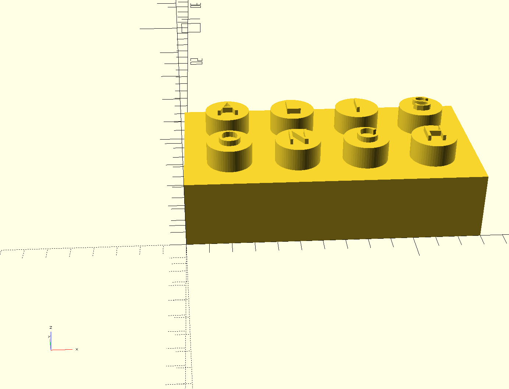
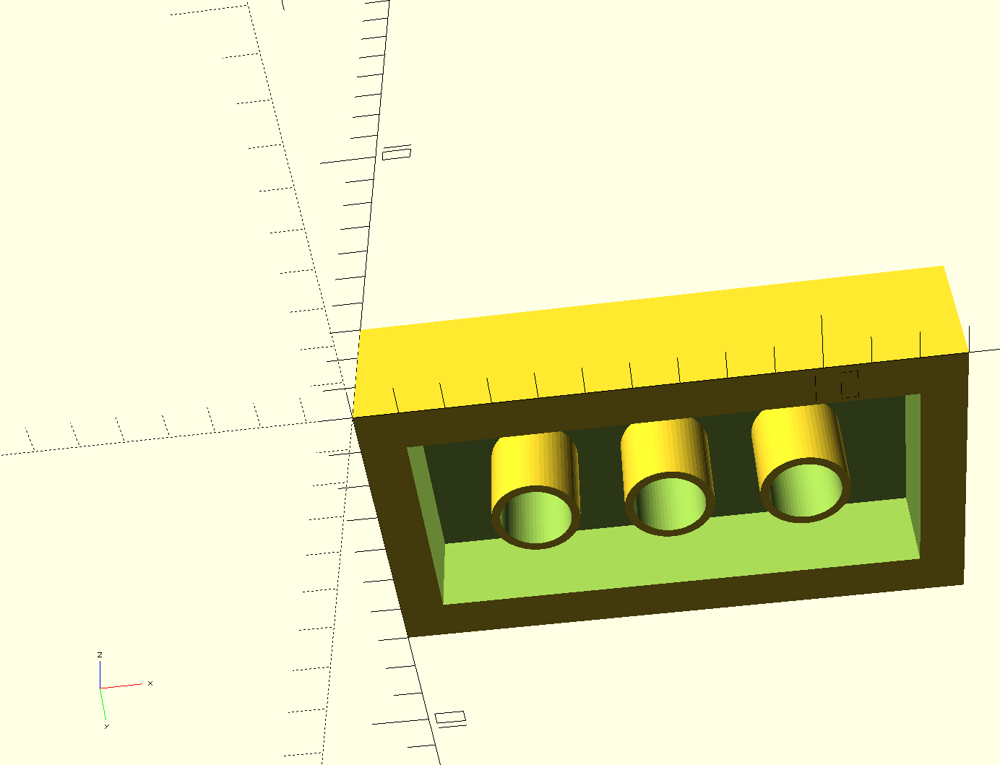

# OpenSCAD Practice

Just practicing parametric 3D modelling.

#### Toy inspired stackable brick

Made sure that the bottom pins can fit exactly between the top pins.

#### USB-C power brick with A-Type wallplug

#### A tiny shelf that came with a tiny wooden house set. Measured it and modeled it in OpenSCAD.
